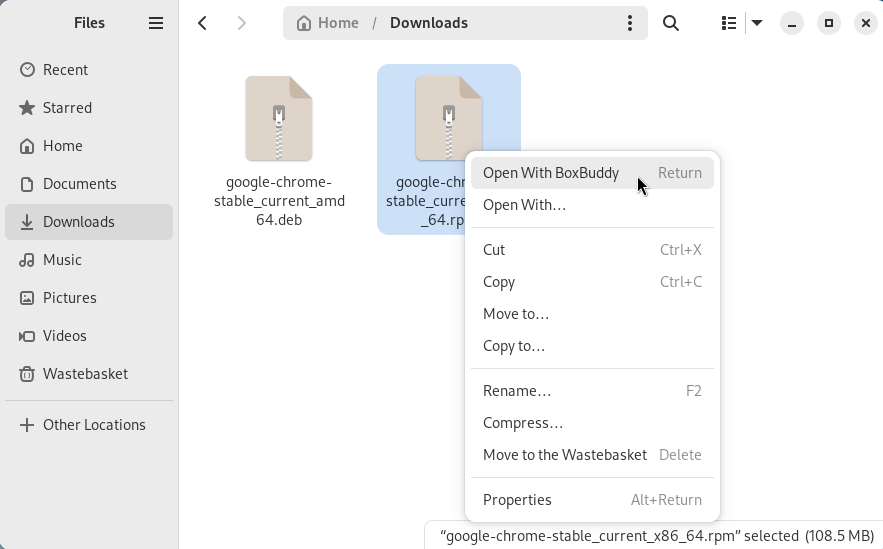

# BoxBuddy User Guide

## Creating a new Distrobox

Click the **+** button in the top-left of the window's header bar. This will bring up a new window where you can enter some options for your new box.

- **Name** - The name of your new box
- **Image** - The container image you wish to use for your new box. You can type the name of a distro to filter the dropdown list.
- **Use Init System** - Activate this switch to add systemd support in your box.
- **Home Directory** - If you wish for your box to have a separate home directory, click the file icon on the right-hand side of this row and choose a folder. **Note**: If you are using the Flatpak and do not see this option, it is because you need to allow Filesystem access to the sandbox. See [the documentation](/BoxBuddyRS/tips) for a guide.
- **Additional Volumes** - If there are other folders, not in your home directory, that you wish for the box to have access to, click the **+** button to spawn a file-picker. Select the appropriate folder and an input row will appear. You can change the value in this input to row to change where the volume will be located
inside your new box. For example, if you want `/opt/my_dir` to live at `/usr/local/my_dir`, select `/opt/my_dir` in the file-picker, then change the value inside the input box to be `/usr/local/my_dir`.

Once these options are filled out, click the blue "Create" button in the top-right of the header bar to create your box. A loading spinner will appear while the box is being created, then a terminal window will spawn to begin initialising the box.

Bear in mind that if you do not have an image on your system when creating a new box, the image must first be pulled from the internet. This can sometimes take a minute or two, so please be patient.

### Using Distrobox Assemble
If you wish to use Distrobox's Assemble feature, click the hammer icon in the top-left, next to the **+** button. 

This will spawn a file-chooser window. Select your `.ini` file and press the blue "Open" button in the file-chooser's header bar.

A pop-up window will appear with a loading spinner, letting you know that your boxes are being created. Upon completion this window will disappear and your new boxes should appear in BoxBuddy. 

**Note** These boxes will need to be initialised before they can be used. Simply click the "Open Terminal" button against each box and wait for the initialisations to finish.

If no boxes appear, your `.ini` file may not be valid. Please check it and try again.

For more information on Distrobox Assemble, [check out the documentation here.](https://distrobox.it/usage/distrobox-assemble/)

## Using the Distrobox

### Opening a Terminal
To open a terminal in the box, click the "Open Terminal" button. This should spawn a terminal window running inside the box.

### Upgrading a Box
Click the "Upgrade Box" button to use the distro's package manager to upgrade all packages in the box. This will spawn a terminal window where you can watch the progress.

### Stopping a Box
If a box is running there will be a stop symbol in the top-right of the application window, next to the box's status (which will probably say "Up X Minutes"). Click this stop button to stop the box.

If the box is definitely running but the button does not appear, click the Reload button in the titlebar (The curved arrow) to reload BoxBuddy's UI. This should update the box's current status and make the stop button appear.

### Removing a Box
Click the "Delete Box" button to remove a box. A confirmation pop-up will appear to make sure you wish to permanently delete the box. Click "Delete" to confirm, or "Cancel" to go back.

### Managing Applications

#### Installing / Removing
Any boxes which support `.deb` or `.rpm` files will have a button labelled "Install .deb File" or "Install .rpm File". Click this button and choose a `.deb` or `.rpm` file to install.

A terminal window will appear with the output from your box's package manager asking you to confirm the packages to install. If you are happy to proceed, type a `y` into the terminal and press `Enter`. The install will then begin. To cancel the install, type an `n` and press `Enter`.

You may also right-click a `.deb` or `.rpm` file in your file manager and choose "Open with BoxBuddy". 

This will open BoxBuddy with a pop-up asking you to choose the box to install this file into. Select your choice of box from the dropdown and press the blue "Install" button in the header bar to begin the installation.

If no boxes supporting the file could be found, BoxBuddy will instead show an error message to let you know that it cannot find an appropriate box. For `.deb` files, a **Debian** box is recommended, and for `.rpm` files a **Fedora** box is recommended.

To install files with the box's CLI package manager, use the "Open Terminal" button to spawn a terminal inside your box, then use the package manager to install and remove packages.

There is currently no way to uninstall an application using BoxBuddy's interface - you must open a terminal and use the package manager to uninstall things.

#### Running
Click the "View Applications" button to see a pop-up containing a list of all applications installed in the box. This may take a few seconds to load. 

Click the "Run" button next to your desired application to execute it.

#### Exporting / Unexporting
In the "View Applications" window you should see either an "Add To Menu" or "Remove From Menu" button next to each application. Clicking the "Add To Menu" button will export this application so that it appears in your system's menu. Likewise, clicking the "Remove From Menu" button will remove it from your menu.

