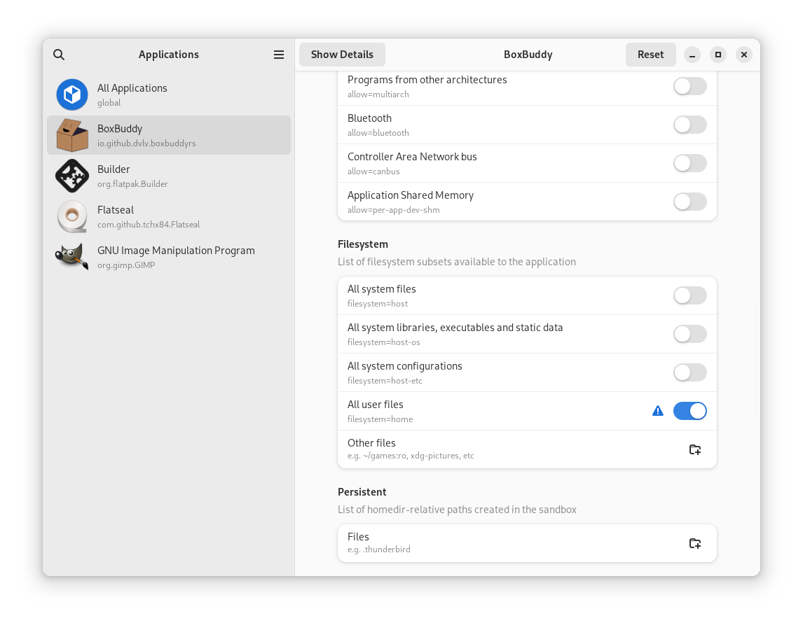

# Tips

## Enabling missing features in the Flatpak version

The flatpak version of BoxBuddy is sandboxed, and cannot access the user's filesystem unless granted permission. This can be done using the command line, or with an application called Flatseal

### What is missing?
- Choosing a Custom Home Directory when creating a box requires `home` access.
- Using Distrobox Assemble requires `home` access.
- Adding Additional Volumes to a container requires `host` access.

### Allowing Filesystem Access via Flatseal
Install Flatseal if you haven't already:

```bash
flatpak install flathub com.github.tchx84.Flatseal
```

Then open it up and click on BoxBuddy in the sidebar.

Scroll down to the **Filesystem** section and enable the switch labelled "All user files" to grant `home` access, or "All system files" to allow full `host` access.



Now BoxBuddy will have access to your filesystem.

### Removing Filesystem Access via Flatseal

Open up Flatseal and select BoxBuddy in the sidebar.

Scroll down to the **Filesystem** section and disable the switch labelled "All user files" and/or "All system files".

Alternatively, you can click the "Reset" button in the application's titlebar to remove all custom permissions from BoxBuddy in one go.

### Allowing Filesystem Access via the Command Line
You will need to determine if BoxBuddy is a user-level or system-level flatpak.

To do this, execute:

```bash
flatpak list --columns=app,installation | grep boxbuddyrs
```

This should say either "user" or "system".

If you have BoxBuddy as a user-level flatpak, execute:

```bash
flatpak override --user io.github.dvlv.boxbuddyrs --filesystem=home
```

If BoxBuddy is instead a system-level flatpak, execute:

```bash
sudo flatpak override io.github.dvlv.boxbuddyrs --filesystem=home
```

To allow `host` access instead, change `--filesystem=home` to `--filesystem=host` above.

### Removing Filesystem Access via the Command Line
After creating your Box with a custom home directory, you may wish to remove filesystem permissions again.

If you have BoxBuddy as a user-level flatpak, execute:

```bash
flatpak override --user --reset io.github.dvlv.boxbuddyrs 
```

If BoxBuddy is instead a system-level flatpak, execute:

```bash
sudo flatpak override --reset io.github.dvlv.boxbuddyrs
```

------
