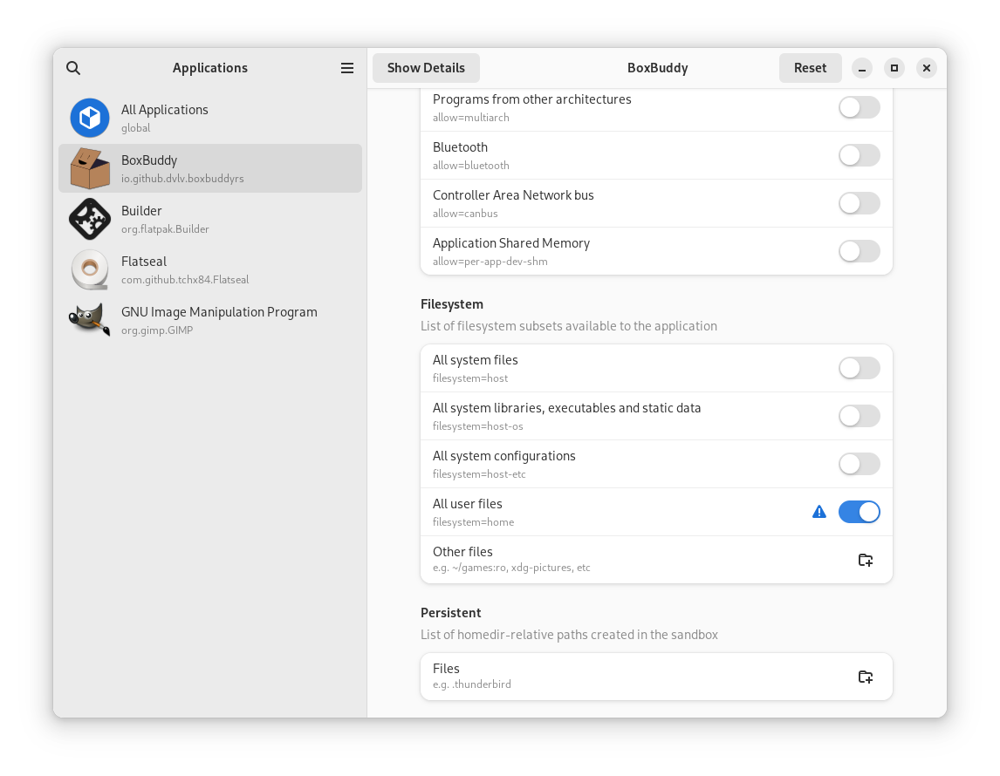

# Tips

## Enabling missing features in the Flatpak version

The Flatpak version of BoxBuddy is sandboxed, and cannot access some of the user's filesystem unless granted permission. This can be done using the command line, or with an application called Flatseal.

By default BoxBuddy has full `home` permissions. You can take these away if you would prefer, but some functionality will be lost.

### What permissions are needed?
- Choosing a Custom Home Directory when creating a box requires `home` access.
- Using Distrobox Assemble requires `home` access.
- Adding Additional Volumes to a container requires `host` access.
- Installing `.deb` / `.rpm` files requires access to the folder which contains them.

### Allowing Filesystem Access via Flatseal
Install Flatseal if you haven't already:

```bash
flatpak install flathub com.github.tchx84.Flatseal
```

Then open it up and click on BoxBuddy in the sidebar.

Scroll down to the **Filesystem** section and enable the switch labelled "All user files" to grant `home` access, or "All system files" to allow full `host` access.



Now BoxBuddy will have access to your filesystem.

### Removing Filesystem Access via Flatseal

Open up Flatseal and select BoxBuddy in the sidebar.

Scroll down to the **Filesystem** section and disable the switch labelled "All user files" and/or "All system files".

Alternatively, you can click the "Reset" button in the application's titlebar to remove all custom permissions from BoxBuddy in one go.

### Allowing Filesystem Access via the Command Line
You will need to determine if BoxBuddy is a user-level or system-level flatpak.

To do this, execute:

```bash
flatpak list --columns=app,installation | grep boxbuddyrs
```

This should say either "user" or "system".

If you have BoxBuddy as a user-level flatpak, execute:

```bash
flatpak override --user io.github.dvlv.boxbuddyrs --filesystem=home
```

If BoxBuddy is instead a system-level flatpak, execute:

```bash
sudo flatpak override io.github.dvlv.boxbuddyrs --filesystem=home
```

To allow `host` access instead, change `--filesystem=home` to `--filesystem=host` above.

### Removing Filesystem Access via the Command Line
After creating your Box with a custom home directory, you may wish to remove filesystem permissions again.

If you have BoxBuddy as a user-level flatpak, execute:

```bash
flatpak override --user --reset io.github.dvlv.boxbuddyrs 
```

If BoxBuddy is instead a system-level flatpak, execute:

```bash
sudo flatpak override --reset io.github.dvlv.boxbuddyrs
```

------

## Running the same application under separate profiles

Some applications keep their settings and logins in your home directory, which
means every box sees the same ones - the box changes the system underneath the
application, not who it is logged in as. If you want the same application under
several identities (say a work account and two personal ones), give each box its
own home directory.

Fill in **Home Directory** when creating the box, for example
`~/boxes/work`. The box then has a home of its own, so anything the application
writes there - its configuration, its credentials, its history - belongs to that
box alone.

Three things stay the way you would want them:

- **Your files on the host are still reachable.** Only the home directory is
  swapped; the rest of the filesystem is mounted as usual, so a project at
  `/home/you/Documents/project` is available inside the box under that same
  path. Note that it is no longer under `~`, so use the full path.
- **Exports still land on the host.** Distrobox knows your real home, so
  applications you add to the menu and commands you add to the terminal appear
  in the host's menu and on the host's `PATH`, not inside the box's private
  home.
- **Each box updates independently.** The application is installed per box, so
  one profile can stay on an older version while another moves on. The flip
  side is that updating means updating each box.

Give the boxes names you will recognise (`work`, `personal`): exported
applications carry the box name in the menu, so the entries stay apart. For
commands, the host name you choose when adding one to the terminal is what you
will type, so `claude-work` and `claude-personal` can live side by side.

If BoxBuddy is installed as a Flatpak, choosing a custom home directory needs
`home` filesystem access - see the section above.
